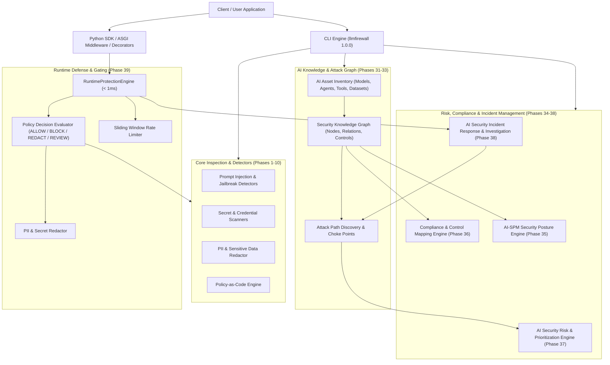

# LLMFirewall System Architecture

LLMFirewall is a lightweight, high-performance, provider-agnostic security, governance, and runtime defense platform for Large Language Models, Multi-Agent Systems, and AI applications.

---

## 1. High-Level Architectural Overview

LLMFirewall unifies threat detection, policy enforcement, knowledge graph reasoning, compliance auditing, posture management, incident response, and sub-millisecond runtime protection into an integrated platform.

---

## 2. End-to-End Architectural Roadmap (Phases 1–40)

LLMFirewall is organized across 40 architectural phases structured into four major milestones:

| Phase Milestone | Phases Included | Scope & Architectural Responsibilities |
|---|---|---|
| **Phase I: Core Detection & Envelopes** | Phases 1–10 | Foundation, Scan envelopes, Regex/Heuristic detectors, Threat scoring, Policy-as-Code, Streaming scanners, Redaction, Audit telemetry. |
| **Phase II: Agent & Capability Defense** | Phases 11–20 | Agent runtime sandboxing, Tool argument validation, Memory poisoning defense, RAG context filtering, Model artifact integrity, Supply-chain SBOMs. |
| **Phase III: Continuous Testing & Evaluation** | Phases 21–30 | Red-teaming fuzzers, Security regression gates, CI/CD integrations, Baseline diffing, SARIF 2.1.0 exports, Multi-modal threat classification. |
| **Phase IV: Knowledge Graph, AI-SPM & Release** | Phases 31–40 | Governance, Security Knowledge Graph, Attack Path Discovery, Asset Inventory, AI-SPM Posture, Compliance & Control Mapping, Risk Prioritization, Incident Response, Runtime Protection, Production Hardening. |

---

## 3. Data Flow & Subsystem Interactions

### 3.1 Runtime Request Lifecycle (< 1ms Execution Path)

1. **Ingress**: A client application invokes an LLM agent decorated with `@fw.protect`, wrapped with `fw.protect_tool()`, or intercepted via `LLMFirewallMiddleware`.
2. **Request Envelope**: The request is normalized into an immutable `RuntimeRequest` with `agent_id`, `input`, `tool`, `rag_context`, and `session_id`.
3. **Sliding-Window Rate Limiting**: The client IP or session key is evaluated against token-bucket/sliding-window limits. Keys are salted and SHA-256 hashed to preserve privacy.
4. **Input Inspection**: User prompts are checked against jailbreak, system prompt extraction, and injection heuristics.
5. **Tool Gating**: If tool execution is requested, tool names and parameters are matched against authorized capability policies. Sensitive or unauthorized operations yield `REVIEW` or `BLOCK`.
6. **Execution & Redaction**: Clean requests execute against downstream LLMs. Generated output is evaluated for PII and secrets before returning to the user.
7. **Incident Correlation**: Any blocked or suspicious action automatically triggers an audit entry and emits a `SecurityEvent` to the Incident Response engine.

### 3.2 Evidence-Driven Risk Prioritization (Phase 37)

The Risk Engine evaluates multi-factor risk without opaque scores:
- **Impact Factors**: Asset business criticality, data sensitivity, downstream reachability.
- **Exposure Factors**: Network exposure (`external`, `internal`, `isolated`), authentication requirements.
- **Security Controls**: Verified presence of compensating controls (e.g. guardrails, rate limits).
- **Epistemic Uncertainty**: Missing data is explicitly marked as `HIGH` uncertainty and never treated as proof of safety.

### 3.3 Security Incident Investigation (Phase 38)

- **Event Ingestion**: Ingests `SecurityEvent` instances from runtime sensors, red team runs, and static scans.
- **Correlation Rules**: Evaluates cross-event sequences (e.g. prompt injection followed by privileged tool execution).
- **Attack Path Linkage**: Connects incidents to known attack graph paths in the Security Knowledge Graph.
- **Containment Hooks**: Automated containment actions (`ISOLATE_AGENT`, `DISABLE_TOOL`, `REVOKE_SESSION`) execute with `dry_run=True` by default.
- **Post-Incident Reporting**: Markdown and JSON exports strictly segregate observed facts from investigative hypotheses.

---

## 4. Security Invariants & Guarantees

1. **Zero Secret Leakage**: Raw API keys, tokens, and credentials are never stored in plain text, logged to stdout, or exported in telemetry.
2. **Sub-Millisecond Runtime Overhead**: Direct inspection paths bypass heavyweight graph traversals, achieving `< 1ms` latency.
3. **Dry-Run Default**: Automated containment actions will NEVER alter production state without explicit `dry_run=False` opt-in.
4. **Deterministic Evaluation**: Policy decisions are deterministic, reproducible, and verifiable with cryptographic SHA-256 evidence digests.
5. **Fail-Closed Safety**: In the event of an unhandled internal exception during runtime evaluation, `FAIL_CLOSED` mode halts the transaction to prevent unmonitored execution.
