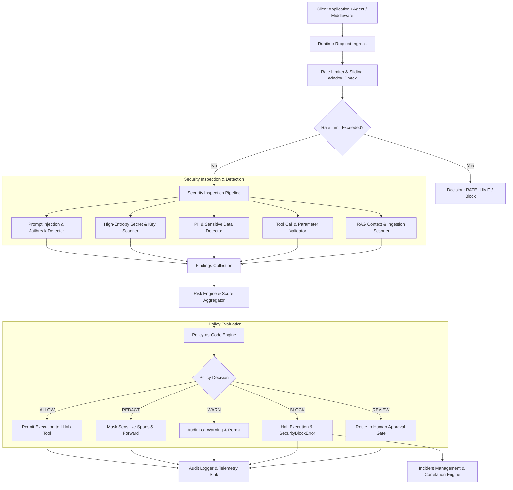

# LLMFirewall System Architecture

LLMFirewall is a lightweight, provider-agnostic, defense-in-depth security and policy enforcement engine designed for Large Language Models (LLMs), Retrieval-Augmented Generation (RAG) pipelines, and autonomous AI agents.

This document details the actual system architecture, component boundaries, execution lifecycles, and security invariants implemented in the `llmfirewall` codebase.

---

## 1. Architectural Philosophy

LLMFirewall enforces four foundational architectural separation-of-concerns rules:

1. **Detectors Detect**: Individual detectors inspect raw inputs, retrieved documents, tool invocations, or model outputs and emit discrete `Finding` objects. Detectors do not decide policy actions or alter traffic.
2. **Risk Engine Quantifies**: The risk engine aggregates findings into quantified `RiskScore` values (0.0–1.0) and categorical severities (`INFO`, `LOW`, `MEDIUM`, `HIGH`, `CRITICAL`), applying exponential diminishing returns and category multipliers.
3. **Policy Engine Decides**: The policy-as-code engine evaluates risk scores, compound rule conditions, and operational modes to render deterministic `PolicyDecision` records (`ALLOW`, `WARN`, `REDACT`, `BLOCK`, `REVIEW`, `RATE_LIMIT`).
4. **Runtime Protection Enforces**: The runtime layer intercepts requests, enforces policy decisions, coordinates redaction, logs structured audit events, and interfaces with the incident response subsystem without third-party network round-trips.

---

## 2. Request Lifecycle & Execution Pipeline

The core execution path for an incoming request through LLMFirewall proceeds through eight sequential stages:



### Stage Details

1. **Input**: An incoming prompt, tool invocation, or model output enters via Python API (`Firewall`, `Scanner`), function decorator (`@protect`), tool wrapper (`protect_tool`), ASGI middleware (`FirewallMiddleware`), or CLI (`llmfirewall`).
2. **Inspection**: The input is normalized (lowercased, unicode-normalized, whitespace-stripped) and evaluated concurrently or sequentially across configured detectors.
3. **Detection**: Detectors produce typed `Finding` objects containing category, confidence, character offsets (`start`, `end`), severity, and diagnostic metadata.
4. **Risk Assessment**: The `RiskEngine` calculates an aggregate risk score using exponential decay ($1.0, 0.5, 0.25, \dots$), ensuring that multiple lower-severity findings compound smoothly without exceeding mathematical bounds.
5. **Policy Engine**: The `PolicyEngine` evaluates the request against active declarative rules (JSON/YAML), matching threat types, risk thresholds, and contextual tags. Precedence resolves conflicts (`BLOCK > REDACT > WARN > ALLOW`).
6. **Decision**: A typed `PolicyDecision` (or `RuntimeDecision`) is emitted with reason, matched rules, and timestamp.
7. **Runtime Enforcement**: 
   - `ALLOW`: Request proceeds unmodified.
   - `REDACT`: Sensitive spans are replaced with configured tokens (e.g. `[REDACTED]`, `[EMAIL_MASKED]`).
   - `BLOCK`: Execution is halted, throwing `SecurityBlockError` or returning HTTP 403.
   - `RATE_LIMIT`: Rejected with rate limit error.
8. **Audit / Incident**: Clean, privacy-safe audit records (`AuditEvent`) are sent to configured sinks. Security violations emit `SecurityEvent` entries to the incident management subsystem for multi-event correlation.

---

## 3. Subsystem Modules

The codebase under `src/llmfirewall` is organized into modular packages:

```text
src/llmfirewall/
├── core/              # Foundational domain models, enums, interfaces, exceptions
├── detectors/         # Deterministic detection engines (injection, pii, secrets)
├── risk/              # Risk scoring, factor weighting, and prioritization engine
├── policy/            # Declarative Policy-as-Code engine, redaction, and rules
├── protection/        # Sub-millisecond runtime protection, rate limiting, and SDK decorators
├── rag/               # RAG context security, document ingestion scanner, quarantine store
├── tools/             # Agent tool call authorization, schema validation, SSRF/SQL checks
├── capabilities/      # Agent capability sandboxing, action budgets, delegation control
├── runtime/           # LLM session lifecycle, loop guard, provider adapters
├── supply_chain/      # Model weight verification, SBOM dependency auditing, artifact integrity
├── eval/              # Adversarial red-team evaluation suite, test generators, mutation engine
├── observability/     # Zero-leakage security telemetry, event stores, Prometheus export
├── governance/        # Security release assurance gates, cryptographic baselines, waivers
├── graph/             # In-memory and SQLite security knowledge graph
├── attack_graph/      # Multi-step attack path discovery, choke points, threat modeling
├── inventory/         # AI asset discovery providers (code, config, dependencies, env)
├── spm/               # AI Security Posture Management (AI-SPM) rule engine and baselines
├── compliance/        # Compliance frameworks (NIST, OWASP, ISO) and control mapping
├── incidents/         # Automated security incident correlation, timelines, and containment
└── cli/               # Unified 21-subcommand CLI
```

---

## 4. Sub-Millisecond Runtime Defense Design

Production LLM deployments cannot tolerate latency additions from security overhead. LLMFirewall achieves sub-millisecond execution times (`~0.02ms` P50 latency in benchmarks) through the following architectural choices:

1. **Zero External Network Dependencies**: All core inspection algorithms execute in-process using compiled regular expressions, deterministic state machines, and Shannon entropy calculations.
2. **Lazy Subsystem Initialization**: Graph analysis, incident investigation, and compliance mapping engines are detached from the primary runtime inspection path.
3. **Zero Plaintext Secret Storage**: Telemetry sinks and audit loggers hash or redact sensitive values immediately upon discovery.
4. **Fail-Safe Defaults**: If an internal error occurs in enforcement mode, `FailBehavior.FAIL_CLOSED` guarantees that insecure uninspected traffic is never silently allowed.

---

## 5. Security Invariants & Boundaries

- **Input Isolation**: Quarantined documents and unverified tool arguments never enter execution context.
- **Privacy Preservation**: Raw secrets, credentials, and customer PII are scrubbed before reaching logging or telemetry sinks.
- **Idempotent Containment**: Incident containment hooks (agent isolation, tool disabling) execute with `dry_run=True` by default to prevent unintended production outages.
- **Auditable Cryptographic Digests**: Baselines, manifests, and incident evidence are fingerprinted using SHA-256 digests for end-to-end verifiability.
